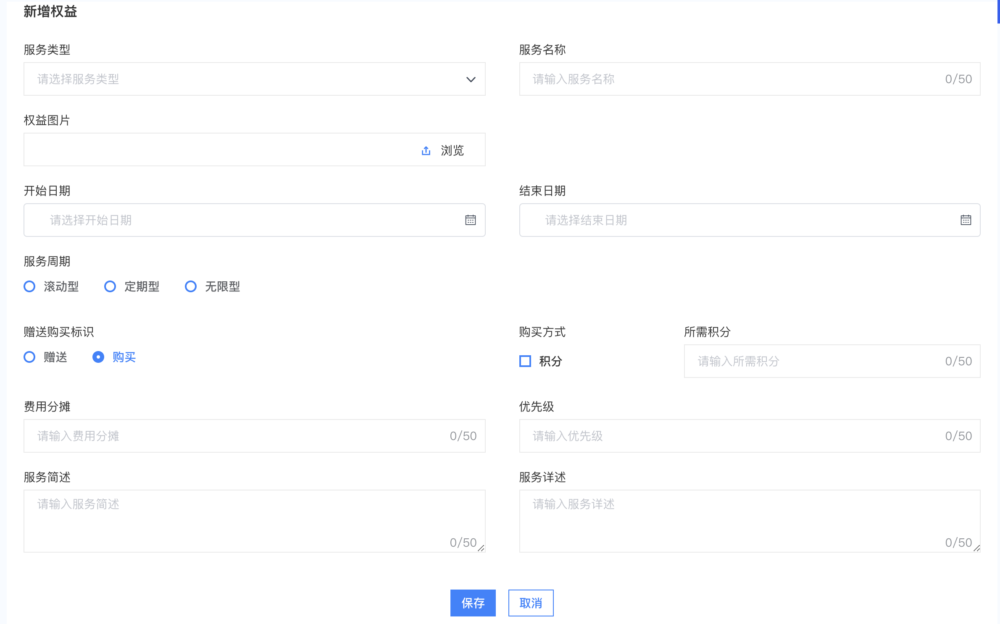

# vFormComponent组件使用说明

## 1，功能简介
### 该组件实现了一个常用的form表单，基于element-ui的form组件封装而成，能满足大部分的简单的form表单的功能。

#### 页面基本布局


## 2，基本使用

```
import { vFormComponent } from '@cp/extend/formComponent'

<v-form-component ref="form"
                  :formConfig="formConfig"
                  :formRules="formRules"
                  :formData="formData"
                  @confirm="onConfirm"
                  @cancel="onCancel"></v-form-component>
```

- ### 组件接收三个props参数

   - formConfig：form表单的配置，Object
   - formRules：字段验证规则的配置，Array
   - formData：form数据

- ### 组件触发3个事件供引用的页面调用

   - confirm：确认按钮点击事件
   - cancel：取消按钮点击事件
   - formValueChange：字段的值发生改变时，立刻触发父组件更新

## 3，formConfig详解

 - 基本格式

 ```
 export const formConfig = {
  title: '标题',
  cols: 2,
  confirmBtnText: '保存',
  cancelBtnText: '取消',
  needValidate: true,
  isSearch: false,
  formItems: []
 }
 ```

- title：标题栏，string，非必填
- cols：列数，number，非必填
- confirmBtnText: 确认按钮文本，string，非必填
- cancelBtnText：取消按钮文本，string，非必填
- needValidate：点击确认按钮提交表单时，是否需要验证，boolean，非必填，不填时不验证
- isSearch：是否是搜索表单，boolean，非必填
- formItems：表单字段配置，Array，详细配置见下文

#### formItems基本格式

formItems数组的每一项必须是数组，每一项的数组里面才是各个字段的配置对象。

这样设计的目的，是一个数组代表一行，可以让相关的字段放在同一个数组，以显示为同一行

```
formConfig = {
  ···,
  formItems: [
    [{
      label: '字段名称',
      key: '字段的key值'
    },{
      label: '字段名称',
      key: '字段的key值'
    }],
    [{},{},{}],
    [{}]
  ]
}
```
- #### 字段的具体配置如下
   - label：字段名称，string，必填
   - key：字段的key值，string，必填
   - span：该字段自定义宽度，number，非必填，参考v-col组件的用法
   - type：字段的类型，string，非必填，默认input，枚举值有
      - input：输入框
      - textarea：文本域
      - select：下拉选择框
      - radio：单选框
      - checkbox：多选框
      - quillEditor：富文本编辑
      - upload：上传组件
      - 'date', 'year', 'month', 'week', 'daterange', 'dates', 'datetime', 'datetimerange'：日期范围选择器
   - placeholder：输入框占位符，string，非必填
   - disabled：是否仅用，boolean，非必填
   - maxLength：输入框最大长度，number，非必填，默认50
   - rows：文本框rows属性，number，非必填
   - isShowWordLimit：输入框是否显示字数统计
   - format：string，type为日期类型时，日期的格式化yyyy-MM-dd HH:mm:ss
   - immediate：字段值改变时是否实时传递给父组件，boolean，默认false，非必填
   - startPlaceholder：日期范围的开始日期占位符
   - endPlaceholder：日期范围的结束日期占位符
   - uploadConfig：type === upload时有效，必填，上传组件的配置,object, {action: ''}
   - previewUrl：function，返回图片预览地址
   - template：模版下载配置，type === upload时有效，{url: '', label: ''}
   - options：当type为radio，select，checkbox时必填，设置该选项的枚举值，array，格式如下
   ```
   // 示例
   {
     label: '状态',
     key: 'status',
     type: 'select',
     options: [
      {label: '生效', value: '0'},
      {label: '待复核', value: '1'},
      {label: '审核中', value: '2'}
    ]
   }
   ```

   - optionsDepends：当一个字段当枚举值要依赖另外一个字段的改变而改变时，则设置该属性，取值为需要依赖的字段，string，非必填
   - optionsRelationShips：和optionsDepends搭配使用，用于计算最后的options值，function，返回值应该与optinos的格式相同
   ```
    let shipFunc = type => {
      return [
        {label: '生效', value: '0'},
        {label: '待复核', value: '1'},
        {label: '审核中', value: '2'}
      ]
    }

   {
     label: '状态',
     key: 'status',
     type: 'select',
     optionsDepends: 'type', // options的取值需要依赖的字段
     optionsRelationShips: shipFunc // 计算options
   }
   ```

   - displayCondition：控制该字段的显示隐藏，object

   ```
   {
     label: '类型',
     key: 'type',
     type: 'radio',
     options: [
      {label: '类型1', value: '1'},
      {label: '类型2', value: '2'},
     ],
   },
   {
     label: '状态',
     key: 'status',
     displayCondition: {
       type: '1'
     }
   }
   ```

## 4，formRules：字段的验证规则，object，参考element-ui组件库的form表单验证规则

## 5，formData：用于设置字段的默认值

## 6，组件触发的事件

- confirm：确认按钮点击触发
- cancel：取消按钮点击触发
- formValueChange：字段值改变时触发，当字段的immediate设为true时，父组件可以通过监听该方法拿到实时更改的值

## 7，ref：通过ref可以调用组件里面的方法

- resetVal：重置搜索表单的值，当用作搜索表单时可用
- setFormValue：主动设置某个字段的值，参数key，value
- validate：表单验证，返回：1 验证通过  0 验证不通过
- getFormData：获取表单数据

