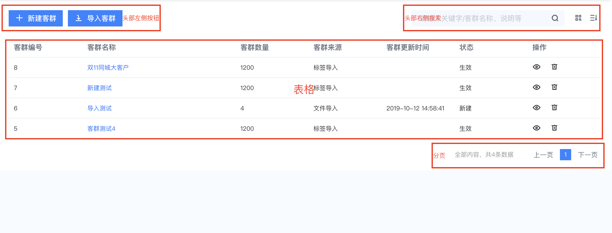

# vtablePageComponent组件使用说明

## 1，功能简介
### 该组件实现了一个基本的列表查询页面的功能，包含头部左侧按钮，头部右侧搜索，表格，分页等基本模块，直接引用该组件，通过一定的配置文件，就可以完成一个列表查询页面的大部分功能。

#### 页面基本布局


## 2，基本使用

```
import { vTablePageComponent } from '@cp/extend/tablePageComponent'

  <v-table-page-component ref="page"
                          :pageConfig="pageConfig"
                          :dataList="dataList"
                          @handleEdit="handleClick">
  </v-table-page-component>
```

- ### 组件接收两个props参数

   - pageConfig：用于整个页面的配置，Object
   - dataList：表格数据，Array

- ### 组件触发一个事件handleEdit供引用的页面调用


## 3，pageConfig详解

- 基本格式

```
export const pageConfig = {
  header: {
    buttons: [],
    filters: {}
  },
  tableIndex: '',
  tableProps: [],
  editTypes: []
}
```

- header：页面头部配置，非必填，默认不显示头部
   - buttons：配置页面头部左侧的按钮区域，array

      - text: 按钮文本
      - svg: 按钮图标，参考v-svg组件使用
      - type: 用于区分按钮的功能，只有一个按钮时可不填

   - filters：配置页面头部右侧的搜索区域，Object

      - isSearch：是否显示搜索框，boolean
      - searchPlaceholder：搜索框placeholder，非必填
      - isMoreSearch：是否显示更多搜索按钮，boolean
      - isSortable：是否显示排序搜索按钮，boolean
      - sortList：排序条件，array，isSortable为true时必填

```
// header示例
header: {
  buttons: [
    {
      text: '新建客群',
      svg: 'xinzeng',
      type: 'newCustomer'
    },
    {
      text: '导入客群',
      svg: 'daoru',
      type: 'importCustomer'
    }
  ],
  filters: {
    isSearch: true,
    searchPlaceholder: '请输入关键字/客群名称、说明等',
    isMoreSearch: true,
    isSortable: true,
    sortList: [
      {command: 'createTime', text: '创建时间'},
      {command: 'num', text: '人数'}
    ]
  }
}
```

- tableIndex：表格是否可多选，string，枚举值：index | selection，默认index，为空时不显示表格选择列

- tableProps：表格字段配置，array，必填

   - prop：该列的要显示的字段，string，必填
   - label：该列的表头，string，必填
   - width：列的宽度，string，非必填
   - align：对齐方式，string，枚举值left ｜ center ｜ right；默认left，非必填
   - color：文字颜色，string，非必填
   - isPic：该列是否显示图片，boolean，非必填
   - previewUrl：图片预览地址，function，返回图片预览地址，isPic为true时必填
   - func：字段处理函数，function，返回处理后的字段，非必填
   - isEdit：是否是编辑列，boolean，非必填，如果是编辑/操作列时，请设为true

```
// 表格配置示例
tableProps: [{
    prop: 'id',
    label: '客群编号'
  }, {
    prop: 'name',
    label: '客群名称',
    width: '300px',
    color: '#2370FD',
    align: 'left',
    isHoverShow: false
  },
  {
    prop: 'picId',
    label: '图片预览',
    isPic: true,
    previewUrl: (row) => {
      return '图片地址'
    }
  },
  {
    prop: 'status',
    label: '状态',
    func: (row) => {
      return '处理后的字段'
    }
  },
  {
    prop: 'edit',
    label: '操作',
    isEdit: true
  }
  ]
```

- editType：表格编辑列功能配置，array，当tableProps中的项isEdit为true时，会读取该字段显示操作按钮
   - 非必填，默认操作是 修改 和 删除

```
// 编辑列功能配置示例
editTypes: ['edit', 'delete']
```

## 4，handleEdit详解

### 组件所有的动作都会通过这一个事件触发到父组件，供父组件进行下一步操作

- 该方法传递一个对象作为参数，对象包含2个key：

   - type：当前操作的操作类型

      - btnClick：头部左侧按钮操作
      - search：头部右侧搜索框搜索操作
      - moreSearch：头部右侧更多搜索按钮点击操作
      - sort：头部右侧排序点击操作
      - edit：表格编辑列操作
      - pageChange：分页查询操作
      - select：表格行选中事件操作

   - param：操作传参

```
// handleEdit使用示例
methods: {
  handleClick ({type, param}) {
    // 按钮点击
    if (type === 'btnClick') {

    }

    // 分页查询
    if (type === 'pageChange') {

    }

    // 更多按钮点击
    if (type === 'moreSearch') {

    }

    // 表格编辑操作
    if (type === 'edit') {

    }
  }
}
```
## 5，slot

### 对于定制化程度比较高的页面，也可以采用slot的方式进行布局

- slot='pageHeader'：通过slot分发整个头部，此时不要在配置文件定义header

- slot='headerBtn'：通过slot分发头部左侧的按钮组，配置文件的header设为{}即可
- slot='filters'：通过slot分发头部右侧的搜索条件，配置文件的header设为{}即可

- slot='pageSearch'：通过slot分发更多搜索条件的查询表单

```
// slot示例
<!-- 页面组件 -->
  <v-table-page-component ref="page"
                          :pageConfig="pageConfig"
                          :dataList="dataList"
                          @handleEdit="handleClick">
    <!-- 搜索表单组件 -->
    <!-- is-folding类名有在公共css文件定义， -->
    <div slot="pageSearch"
         :class="['page-search', {'is-folding': isFoldSearch}]">
      <v-form-component ref="searchForm"
                        :formConfig="searchFormConfig"
                        @confirm="onSearchByCondition"
                        @cancel="onReset"></v-form-component>
    </div>
  </v-table-page-component>

  ···
  data () {
    return {
      isFoldSearch: false // 控制搜索条件栏的显示隐藏
    }
  },
  methods: {
    handleClick ({type, param}) {
    // 更多按钮点击
    if (type === 'moreSearch') {
      this.isFoldSearch = !this.isFoldSearch
    }
  }
  }
```

## 6，ref：给组件设置ref，可以调用组件的属性和方法

```
<v-table-page-component ref="page"
                          :pageConfig="pageConfig"
                          :dataList="dataList"
                          @handleEdit="handleClick">
  </v-table-page-component>

  // 获取组件的属性
  this.$refs.page.currentPage // 页码
  this.$refs.page.pageSize // 每页显示数量

 // 调用组件的方法
  this.$refs.setVal('total', 100) // 设置查询回来的总数量
```
